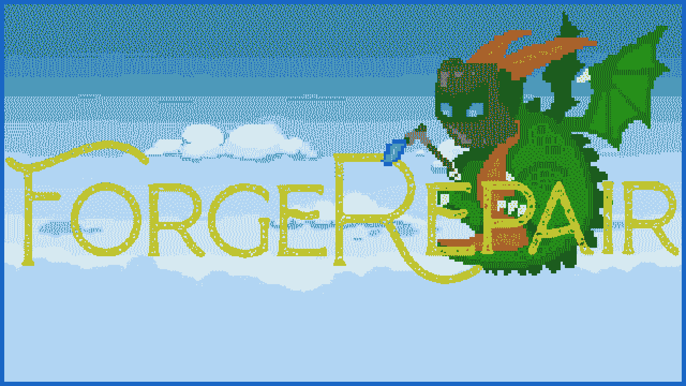

  

  <h1>Forge Repair</h1>
  
A 2D party game.

Forge Repair is a 2D party game; 
Created in 48H for the Global Game Jam 2020 on the theme of repair.

There is mini games like a clicker and a color matching one. 
This game is about a blacksmith dragon who try to fix magical weapons and armor by his flame and might.
